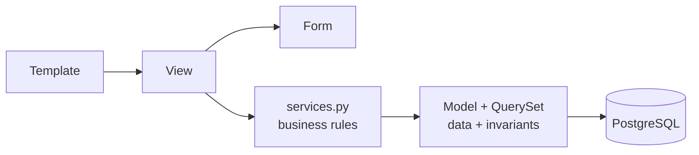

# Clean architecture, Django-sized (pykaraoke)

This is a small MTV app for a private karaoke night. Full hexagonal architecture would cost more
than it returns here. The rule is **one thin service layer, and nothing else**.

## The layers



Dependencies point right. A model never imports a view. `services.py` never imports
`HttpRequest`.

## Where does it go?

| The logic is... | It belongs in | Example |
|---|---|---|
| A fact about **one** object | model method or property | `event.is_open` |
| A **reusable query** | custom QuerySet method | `Participant.objects.confirmed()` |
| A **database invariant** | `Meta.constraints` | one pseudo per event |
| **Shape** of user input | form `clean_*` | pseudo ≥ 2 chars |
| A **rule spanning objects**, or a state change with side effects | `services.py` | `reserve_seat()` promotes from the waiting list and sends the confirmation |
| **HTTP** concerns: status, redirect, messages, session | view | POST/Redirect/GET |
| **Presentation** | template / template tag | date formatting |

Fast test: *could this rule be true in a CLI command with no browser?* If yes → service or model.
If no → view.

## The service layer

```python
# karaoke/services.py
def reserve_seat(event: KaraokeEvent, pseudo: str, full_name: str) -> Participant:
    """Reserve a seat, or join the waiting list when the event is full."""
    if not event.is_open:
        raise EventClosedError(event.pk)

    status = Participant.Status.CONFIRMED if event.seats_left > 0 else Participant.Status.WAITING
    participant = Participant.objects.create(
        event=event, pseudo=pseudo, full_name=full_name, status=status
    )
    notifications.send_confirmation(participant)
    return participant
```

Rules for `services.py`:
- Takes and returns **domain objects**, never `request`, never `QueryDict`, never `form`.
- Raises domain exceptions (`KaraokeError` subclasses). Never returns `None` to mean failure.
- Wraps multi-write operations in `transaction.atomic()`.
- Is the **only** place the view calls for a state change.

## When NOT to abstract

The strongest signal that this project is being over-engineered:

- ❌ A `repositories.py` wrapping the ORM. Django's ORM **is** the repository.
- ❌ A `UseCase` class with a single `execute()` method. That is a function with extra steps.
- ❌ Interfaces / ABCs with exactly one implementation.
- ❌ DTOs mirroring models field-for-field.
- ❌ A `domain/` package separate from `models.py` in an app this size.

Rule of three: extract on the **third** repetition, not the first. Two similar blocks are a
coincidence; three are a pattern.

## When a view gets long

Diagnose before refactoring:

1. Is it doing more than one HTTP thing? → split into two views/URLs.
2. Is it computing something for the template? → model property or context helper.
3. Is it applying a business rule? → move to `services.py`.
4. Is it just a long form + render? → that is fine, leave it.

## Migration path (documented, not built)

If this app ever grows past ~15 models or gains a second delivery channel (an API, a bot), the
next step is one package per bounded context (`events/`, `songs/`) — still Django apps, still
this same service layer. Do not pre-build it.

## See also

- Concrete model/view/form code: skill `django-mtv`
- Function shape and exceptions: skill `python-standards`
- Review of an existing layering choice: agent `backend-patterns`
