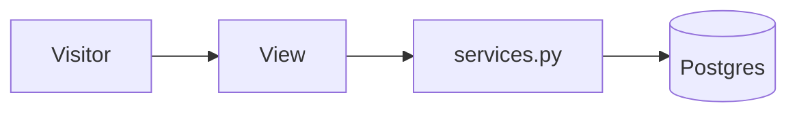

# Writing docs (pykaraoke)

Audience: the author, six months from now, having forgotten everything. Second audience: an agent
loading the doc as context. Both want the same thing — **short, structured, current**.

## Shape of a doc

1. **Title** (`# Name`).
2. **One-line purpose**, italic, directly under the title. What question does this file answer?
3. **A diagram or a table**, before any long prose.
4. Sections with `##`, ordered most-asked-first.
5. **See also** at the bottom, linking sibling docs and skills.

## Rules

- **Table over paragraph.** Anything with more than two parallel cases is a table.
- **Diagram over description.** If you are describing a flow, a sequence, or a set of
  relationships in words, draw it instead.
- **Never explain what the code already says.** Explain *why* the decision was made and *what
  breaks* if it changes.
- **No filler.** Delete "It is important to note that", "In order to", "simply", "basically".
- **Present tense, active voice.** "The view redirects", not "the view will be redirecting".
- **Every code block is runnable or clearly marked as a sketch.**
- **Line length ~100 chars** so diffs stay readable.

## Mermaid

Diagrams are mermaid fenced blocks — GitHub renders them natively, no images to keep in sync.

| Situation                                | Diagram           |
|------------------------------------------|-------------------|
| Request path, pipeline, layer dependency | `flowchart LR`    |
| Decision: "which thing do I use?"        | `flowchart TD`    |
| Who talks to whom, in order, over time   | `sequenceDiagram` |
| Models and their relations               | `erDiagram`       |
| Status field lifecycle                   | `stateDiagram-v2` |



Diagram rules:
- **Under 12 nodes.** Past that, split it into two diagrams.
- Label the **edges**, not just the nodes — the verb is the information.
- Use `<br/>` for line breaks inside a node label.
- Do not put colors or styling in the diagram; the theme handles it.
- No mermaid for a two-step sequence. A sentence is fine.

## Doc ownership

| Change you made                                  | Doc to update, same commit             |
|--------------------------------------------------|----------------------------------------|
| New/changed model or field                       | `docs/DATABASE.md`                     |
| New/changed URL, view, or form field             | `docs/API.md`                          |
| New layer, app, or structural decision           | `docs/ARCHITECTURE.md`                 |
| Anything touching auth, tokens, or personal data | `docs/SECURITY.md`                     |
| New env var, service, or setup step              | `docs/SETUP.md` + `.env.example`       |
| New or changed workflow                          | `docs/CI-CD.md`                        |
| New skill, agent, or rule                        | `docs/AI-WORKFLOW.md` + `CLAUDE.md`    |
| Anything user-visible                            | `CHANGELOG.md` under `## [Unreleased]` |

A PR that changes behaviour without touching a doc gets one question in review: *which of these
was it?*

## CHANGELOG

Keep a Changelog format, SemVer. Entries are written for a **user of the site**, not a developer:

```markdown
## [Unreleased]
### Added
- Waiting list: sign-ups past the seat limit now queue instead of being refused.
### Fixed
- Cancelling a seat now promotes the first person on the waiting list.
```

Never "refactored services.py". That is a commit message, not a changelog entry.

## Language

English for all documentation, code, and commit messages. User-facing strings in the app are
French by default (Japanese secondary) via Django i18n — that split is deliberate, see
`docs/ARCHITECTURE.md`.

## See also

- The diagram-heavy example to copy: `docs/AI-WORKFLOW.md`
- Doc drafting at scale: agent `doc-writer`
- Finding the authoritative answer before writing: agent `doc-lookup`
