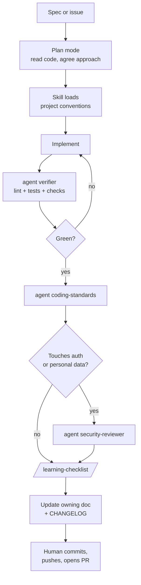
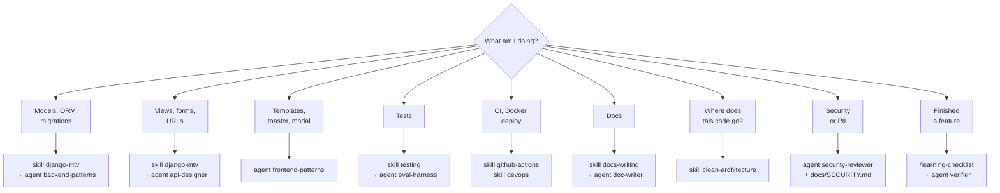
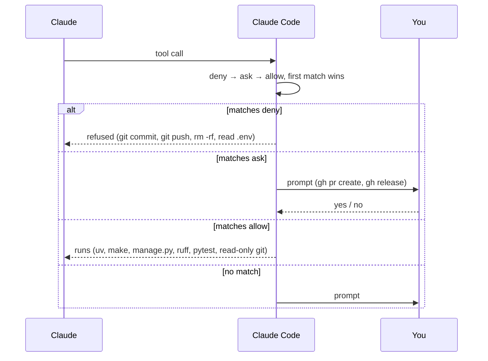

# AI workflow

*How Claude Code is set up in this repo, and how to work with it.*

Everything lives in `.claude/`. Three surfaces, one rule set.

## The three surfaces

| Surface   | What it is                                                   | Where                            | Loaded                                                         |
|-----------|--------------------------------------------------------------|----------------------------------|----------------------------------------------------------------|
| **Skill** | Reusable knowledge — this project's conventions for a topic  | `.claude/skills/<name>/SKILL.md` | On demand, into the main conversation                          |
| **Agent** | A worker with its own fresh context and a restricted toolset | `.claude/agents/<name>.md`       | When delegated to; its output comes back, its context does not |
| **Rule**  | Enforced by the harness, not by the model                    | `.claude/settings.json`          | Always                                                         |

The difference that matters: a **skill** changes how Claude works. An **agent** does a job
somewhere else and reports back — use one when the job would flood the conversation with files.
A **rule** is the only one the model cannot talk its way past.

## The feature loop

Step `L` is not a formality: Claude is **denied** commit and push. The last move is always yours.

## Which surface do I reach for?

Unsure whether a library behaves the way you remember? **agent `doc-lookup`** — it cites the
version-pinned page instead of guessing.

## Skills

| Skill                | Use it for                                                           |
|----------------------|----------------------------------------------------------------------|
| `python-standards`   | Type hints, early returns, naming, exceptions, why a Ruff rule is on |
| `django-mtv`         | Models, QuerySets, migrations, fo rms, views, URLs, templates, N+1   |
| `clean-architecture` | Where a piece of logic belongs; when **not** to abstract             |
| `testing`            | pytest-django, factories, what is worth testing, coverage            |
| `github-actions`     | Workflow anatomy, uv caching, service containers, environments       |
| `devops`             | uv, Makefile, Docker, env vars, Postgres, deploy skeleton            |
| `docs-writing`       | Doc structure, mermaid rules, which doc owns which change            |
| `learning-checklist` | `/learning-checklist` — the retention step at the end of a feature   |

## Agents

| Agent               | Job                                                   | Model  |
|---------------------|-------------------------------------------------------|--------|
| `doc-writer`        | Writes/updates docs in house style                    | sonnet |
| `doc-lookup`        | Finds the authoritative answer, cites it              | haiku  |
| `verifier`          | Runs the checks, reports real output                  | sonnet |
| `coding-standards`  | Flags convention deviations Ruff cannot see           | sonnet |
| `api-designer`      | Designs routes and form contracts, updates `API.md`   | sonnet |
| `eval-harness`      | Designs and runs a feature's test suite, reports gaps | sonnet |
| `backend-patterns`  | Models, queries, migrations, services review          | sonnet |
| `frontend-patterns` | Templates, forms, toaster, modal, i18n, a11y          | sonnet |
| `security-reviewer` | Django security, OWASP basics, PII policy             | opus   |

Read-only reviewers run in plan mode — they cannot edit. `doc-writer`, `api-designer` and
`eval-harness` keep project memory, so conventions accumulate across sessions.

## Rules

`.claude/settings.json` is committed, so the rules apply to everyone who clones the repo.

| Rule                                                                   | Why                                                  |
|------------------------------------------------------------------------|------------------------------------------------------|
| **deny** `git commit`, `git push`                                      | Committing is a human decision. Non-negotiable.      |
| **deny** `git reset --hard`, `git rebase`                              | History loss is unrecoverable from inside a session. |
| **deny** `rm -rf`                                                      | Same.                                                |
| **deny** `Read(./.env*)`                                               | Claude never sees real secrets.                      |
| **ask** `gh pr create`, `gh release`                                   | Outward-facing — you confirm each one.               |
| **allow** `uv`, `make`, `manage.py`, `ruff`, `pytest`, read-only `git` | Project-scoped, reversible, runs unattended.         |

A `PostToolUse` hook runs `ruff format` + `ruff check --fix` on every Python file Claude edits, so
formatting never reaches review. It no-ops silently until `uv` and `pyproject.toml` exist.

## Adding a skill or an agent

1. **Skill** → `.claude/skills/<name>/SKILL.md`; **agent** → `.claude/agents/<name>.md`.
2. Frontmatter: `name` + `description`. The description is a **trigger**, not a summary — lead
   with the phrases you would actually type ("when creating a model", "when CI is red"). Under
   1536 characters.
3. **Hard cap: 200 lines.** A skill nobody reads to the end is a skill that does not work. Move
   depth into a sibling file and link to it.
4. Project-specific beats generic. "Use `select_related` for forward FKs" is worth writing;
   "Django is a web framework" is not.
5. Agents get a `tools` allowlist. Reviewers get `permissionMode: plan`.
6. Register it in [`CLAUDE.md`](../CLAUDE.md) and in the tables above — an unregistered skill is
   one Claude will not find.

Verify with `claude doctor`, then `/skills` and `/agents`.

## Anti-patterns

- **Skipping plan mode on anything non-trivial.** Agreeing on the approach costs one message;
  undoing the wrong approach costs an afternoon.
- **Delegating to an agent what a skill would fix.** An agent starts cold and re-derives context
  you already have.
- **Letting docs drift.** The doc-ownership table in the `docs-writing` skill says which file owns
  which change; update it in the same commit.
- **Shipping without the learning checklist.** The point of this project is what you retain, not
  what you deploy.

## See also

- Index of everything: [`CLAUDE.md`](../CLAUDE.md)
- What gets built when: [EPICS.md](EPICS.md)
- Retention checklists: [learning/README.md](learning/README.md)
