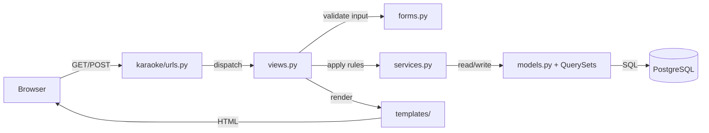
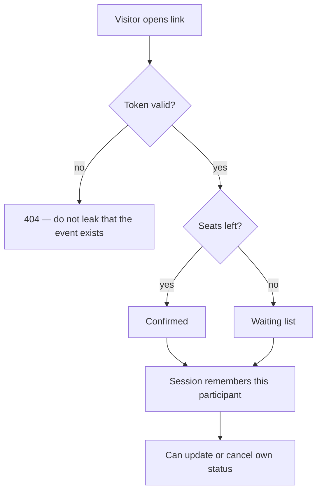

# Architecture

*How pykaraoke is structured, and why it is structured that way.*

## Request flow



The arrows only point one way. `models.py` never imports a view; `services.py` never sees an
`HttpRequest`.

## Project layout

```
pykaraoke/            # project package — configuration only, no features
  settings.py         # split into base/dev/prod in Milestone 1
  urls.py             # includes karaoke.urls
  wsgi.py, asgi.py
karaoke/              # the single app — all features live here
  models.py           # KaraokeEvent, Participant, SongRequest, AccessLink
  managers.py         # custom QuerySets (reusable filters)
  forms.py            # input shape + field validation
  services.py         # business rules and state changes
  exceptions.py       # KaraokeError and subclasses
  views.py            # HTTP orchestration only
  urls.py             # app_name = "karaoke"
  templates/karaoke/  # pages + partials/
  templatetags/
  migrations/
tests/                # mirrors the source tree
docs/                 # this folder
.claude/              # skills, agents, permissions — see AI-WORKFLOW.md
```

**One app, not many.** The whole domain is four models and five pages. Splitting it into
`events/`, `signups/`, `songs/` would add import ceremony and buy nothing. If the app ever grows
past ~15 models or gains a second delivery channel, that is when to split.

## Why MTV and not a JSON API

The spec's non-goals are explicit: no multi-page SPA, no real authentication, no persistent user
data. Django's server-rendered MTV gives forms, CSRF, validation, messages and i18n for free.
Adding DRF plus a frontend framework would mean re-implementing all of it in JavaScript for a site
five people use on a Friday night.

Interactivity that needs it (the toaster, the cancel modal) is progressive enhancement on top of
working HTML forms. A user with no JavaScript can still sign up and cancel.

## The service layer

`services.py` is the only deliberate abstraction. It exists so that:

- views stay short enough to read in one screen,
- business rules are testable without an HTTP client,
- a rule that spans two models has one obvious home.

What goes where:

| Logic | Home |
|---|---|
| A fact about one object | model method or property |
| A reusable query | custom QuerySet method |
| A database invariant | `Meta.constraints` |
| Shape of user input | form `clean_*` |
| A rule spanning objects, or a state change with side effects | `services.py` |
| Status codes, redirects, messages, session | view |
| Formatting | template or template tag |

Deliberately **absent**: repository classes, use-case objects, DTOs, single-implementation
interfaces, a `domain/` package. See the `clean-architecture` skill for why.

## Access model

There are no user accounts. Access is a single unguessable link per event.



The session is a convenience so a returning visitor sees their own row highlighted — it is not a
security boundary. Every state change re-checks the token server-side. Details in
[SECURITY.md](SECURITY.md).

## Internationalisation

Documentation, code and commits are in **English**. User-facing strings are **French by default**,
with Japanese as a secondary locale — that is the audience, per the spec.

Every visible string goes through `gettext_lazy` in Python and `` in templates from
the first commit that introduces it. Retro-fitting i18n after the fact means touching every
template again.

## Boundaries this project will not cross

- No user accounts, no passwords, no OAuth.
- No SPA, no client-side router, no build step for JavaScript.
- No background worker queue. The one scheduled job (data purge) is a management command run by
  cron.
- No multi-tenancy. One group of friends, many events.

## See also

- Models and relations: [DATABASE.md](DATABASE.md)
- Routes and forms: [API.md](API.md)
- Access, data retention, secrets: [SECURITY.md](SECURITY.md)
- How Claude works in this repo: [AI-WORKFLOW.md](AI-WORKFLOW.md)
