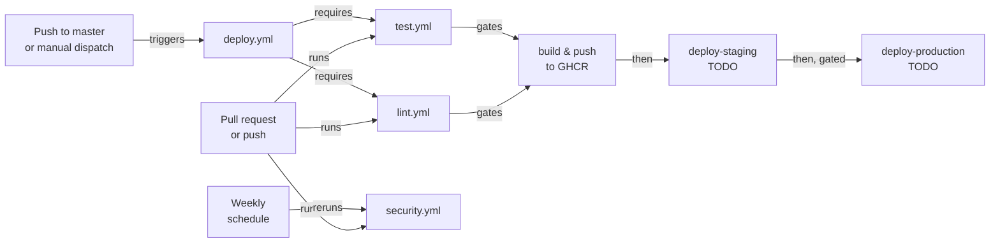

# CI/CD

*The four GitHub Actions workflows: what triggers each one, what every step does, and what this
pipeline does not do yet.*

## Pipeline overview

`deploy.yml` doesn't duplicate lint or test steps. It calls `lint.yml` and `test.yml` as
reusable workflows (`workflow_call`), so one file still defines what "passes" means for each.

## `lint.yml`

Triggers: push to `master`, every pull request, and `workflow_call` (so `deploy.yml` can require
it).

1. **Checkout**: clones the repo at the triggering commit.
2. **Install uv** (`astral-sh/setup-uv@v10.1.0`). Installs `uv` itself and restores its
   dependency cache, keyed on `uv.lock`.
3. **Install dependencies**: `uv sync --locked --all-groups`. `--locked` fails the job outright
   if `uv.lock` doesn't match `pyproject.toml`, rather than silently re-resolving.
4. **Cache pre-commit hook environments**: restores `~/.cache/pre-commit`, keyed on
   `.pre-commit-config.yaml`'s hash, so the hook environments aren't rebuilt every run.
5. **Run pre-commit**: `uv run pre-commit run --all-files --show-diff-on-failure`. The exact same
   command and config the local git hook runs: Ruff check, Ruff format, then the four file-hygiene
   hooks. `--show-diff-on-failure` prints the diff, since there's no interactive terminal here.

## `test.yml`

Triggers: same as `lint.yml`. Matrix: Python 3.13 and 3.14, `fail-fast: false` so one version
failing doesn't hide the other's result.

1. **Checkout**
2. **Install uv**: same as `lint.yml`, plus `python-version: ${{ matrix.python-version }}` so
   `uv` provisions that specific interpreter for the job.
3. **Install dependencies**: `uv sync --locked --all-groups`.
4. **Run tests**: `uv run pytest --cov --cov-report=xml --cov-report=html --cov-report=term`. No
   Postgres service container yet. See "What's missing" below.
5. **Upload coverage report**: one artifact per Python version, kept 14 days. `if: always()` so a
   failing run still uploads the report that shows why.

## `security.yml`

Triggers: push to `master`, every pull request, and a weekly schedule (Monday 06:00 UTC). A new
CVE needs no code change on this repo's side to matter, so `pip-audit` reruns regardless of
activity.

1. **Checkout**
2. **Install uv**
3. **Install dependencies**
4. **Bandit**: `uv run bandit -qr . -c pyproject.toml`. The `-c` is required, or bandit ignores
   `[tool.bandit]` entirely and crawls `.venv`'s thousands of files instead of the real source.
5. **pip-audit**: checks every locked dependency against known vulnerability databases.
6. **Django deploy check**: `manage.py check --deploy --tag security --fail-level WARNING`, under
   throwaway production-shaped env vars (not real secrets. Just values that satisfy the checks'
   length/entropy/non-empty requirements). Scoped to the `security` tag because nothing configures
   a real SMTP backend yet; the unscoped `--deploy` check would fail on `mail.E001` regardless of
   environment.

## `deploy.yml`

Triggers: push to `master`, or manual `workflow_dispatch`. No `cancel-in-progress`. A
half-cancelled deploy is worse than a queued one.

1. **`lint` / `test`**: calls `lint.yml` and `test.yml` as reusable workflows. The `build` job
   requires both, so a broken lint or a broken test blocks the image from ever being built.
2. **`build`**: checkout, set up Docker Buildx, log in to GHCR (`GITHUB_TOKEN`, no personal
   access token needed), extract image metadata (`docker/metadata-action` tags the image with the
   short git SHA and `latest` on the default branch), then build and push
   (`docker/build-push-action`, using the GitHub Actions cache backend).
3. **`deploy-staging`**: `environment: staging`. Currently a `TODO` placeholder that echoes the
   image reference; nothing is wired to a host yet.
4. **`deploy-production`**: `needs: [build, deploy-staging]`, `environment: production`. Also a
   `TODO` placeholder. `environment:` is what gives `production` its required-reviewer gate, once
   someone configures reviewers for it.

## What's missing

- **No real deploy provider.** Both `deploy-staging` and `deploy-production` are `TODO` echo
  commands. The provider decision lands in Milestone 3 (see the `devops` skill's "Deploy
  skeleton" section).
- **No Postgres service container in `test.yml`.** `DATABASE_URL` is blank (SQLite fallback) and
  there are zero models until Milestone 2; the container arrives with the first real migration.
- **Required-reviewer protection on the `production` environment is not configured.** GitHub
  auto-creates the `staging`/`production` environments the first time this workflow references
  them, but reviewer gating is a manual step in **Settings → Environments**. Nothing in this repo
  enforces it.
- **Branch protection on `master` is not configured.** `deploy.yml`'s own reusable-workflow gate
  (`needs: [lint, test]`) protects the deploy path regardless, but a PR could still merge into
  `master` without lint, test, or security passing unless required status checks are turned on.
- **`make db-up` and the Dockerfile build have never actually run.** Docker isn't installed on the
  primary dev machine for this project. Flagged since the very first environment check, not
  hidden. `docs/SETUP.md` documents the SQLite-only path as the one that's actually been verified.
- **No dependency-update automation.** `pip-audit` detects known vulnerabilities; nothing (yet)
  opens a PR to fix them. No Dependabot or Renovate configuration exists.
- **No error tracking or uptime monitoring.** Out of scope until something is actually deployed
  for it to watch.

## See also

- Workflow anatomy, action versions, and how to verify one before pushing: skill `github-actions`
- Docker image the `build` job produces: skill `devops`
- Local equivalent of every CI gate: the `Makefile`
- Fresh-machine setup: [SETUP.md](SETUP.md)
