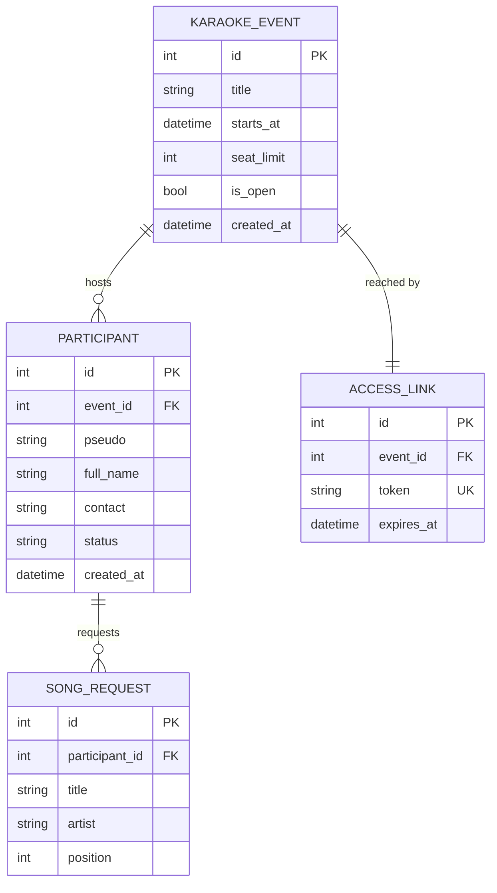
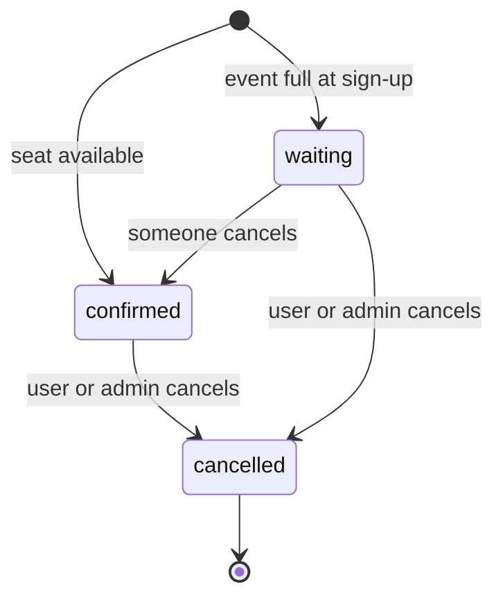

# Database

*The data model, its invariants, and how long each row is kept.*

Status: **designed, not implemented.** Models land in Milestone 2. Change this document first,
then write the migration.

## Entity relationships



## KaraokeEvent

The night itself. Created by the admin.

| Field        | Type                               | Notes                                              |
|--------------|------------------------------------|----------------------------------------------------|
| `title`      | `CharField(120)`                   | e.g. "Karaoké du 12 septembre"                     |
| `starts_at`  | `DateTimeField`                    | Indexed — the overview lists upcoming events first |
| `seat_limit` | `PositiveSmallIntegerField`        | Above this, sign-ups go to the waiting list        |
| `is_open`    | `BooleanField(default=True)`       | Admin closes sign-ups without deleting the event   |
| `created_at` | `DateTimeField(auto_now_add=True)` |                                                    |

Derived, as model properties — not stored:
- `seats_left` = `seat_limit` − confirmed participants
- `is_full` = `seats_left <= 0`

## AccessLink

The unguessable URL that replaces authentication. One per event.

| Field        | Type                                        | Notes                           |
|--------------|---------------------------------------------|---------------------------------|
| `event`      | `OneToOneField(KaraokeEvent, CASCADE)`      | `related_name="access_link"`    |
| `token`      | `CharField(43, unique=True, db_index=True)` | `secrets.token_urlsafe(32)`     |
| `expires_at` | `DateTimeField`                             | Defaults to `starts_at` + 1 day |

Never a sequential id, never derived from the event's data. Rotating the token invalidates every
copy of the old link — that is the "revoke access" mechanism.

## Participant

One person signed up to one event.

| Field        | Type                                     | Notes                                          |
|--------------|------------------------------------------|------------------------------------------------|
| `event`      | `ForeignKey(KaraokeEvent, CASCADE)`      | `related_name="participants"`                  |
| `pseudo`     | `CharField(40)`                          | Shown publicly on the overview                 |
| `full_name`  | `CharField(80, blank=True, default="")`  | **PII**                                        |
| `contact`    | `CharField(120, blank=True, default="")` | **PII** — email or phone, for the confirmation |
| `status`     | `CharField(16, choices=Status)`          | `confirmed` / `waiting` / `cancelled`          |
| `created_at` | `DateTimeField(auto_now_add=True)`       | Decides waiting-list order                     |

Constraints:
- `UniqueConstraint(fields=["event", "pseudo"], name="unique_pseudo_per_event")`
- `ordering = ["created_at"]` — the waiting list is first-come, first-served



Cancelling a **confirmed** participant promotes the oldest `waiting` participant. That promotion
is a business rule, so it lives in `services.py` and is wrapped in `transaction.atomic()`.

## SongRequest

Songs a participant wants to sing. The "gain time choosing their songs" goal.

| Field         | Type                                     | Notes                          |
|---------------|------------------------------------------|--------------------------------|
| `participant` | `ForeignKey(Participant, CASCADE)`       | `related_name="song_requests"` |
| `title`       | `CharField(160)`                         |                                |
| `artist`      | `CharField(120, blank=True, default="")` |                                |
| `position`    | `PositiveSmallIntegerField(default=0)`   | The participant's own ordering |

`MAX_SONGS_PER_PARTICIPANT` is enforced in `services.py`, not in the schema — it is a policy that
may change per event, not a data invariant.

## Retention

| Table                               | Kept until                                    | Purged by                  |
|-------------------------------------|-----------------------------------------------|----------------------------|
| `KaraokeEvent`                      | indefinitely                                  | manual admin deletion      |
| `AccessLink`                        | `expires_at`                                  | purge job clears the token |
| `Participant.full_name`, `.contact` | 7 days after `starts_at`                      | scheduled purge job        |
| `Participant.pseudo`, `.status`     | kept — no longer personal once names are gone | —                          |
| `SongRequest`                       | 7 days after `starts_at`                      | scheduled purge job        |

The purge is a management command run on a schedule. Adding a PII field without adding it to the
purge is a security finding — see [SECURITY.md](SECURITY.md).

## Query expectations

The admin and user overview pages must be **O(1) queries**, not O(participants):

```python
KaraokeEvent.objects.prefetch_related(
    Prefetch("participants", queryset=Participant.objects.prefetch_related("song_requests"))
)
```

`tests/karaoke/test_views.py` locks this in with `django_assert_num_queries`.

## See also

- Layer boundaries: [ARCHITECTURE.md](ARCHITECTURE.md)
- Routes and form fields: [API.md](API.md)
- Retention policy and PII rules: [SECURITY.md](SECURITY.md)
