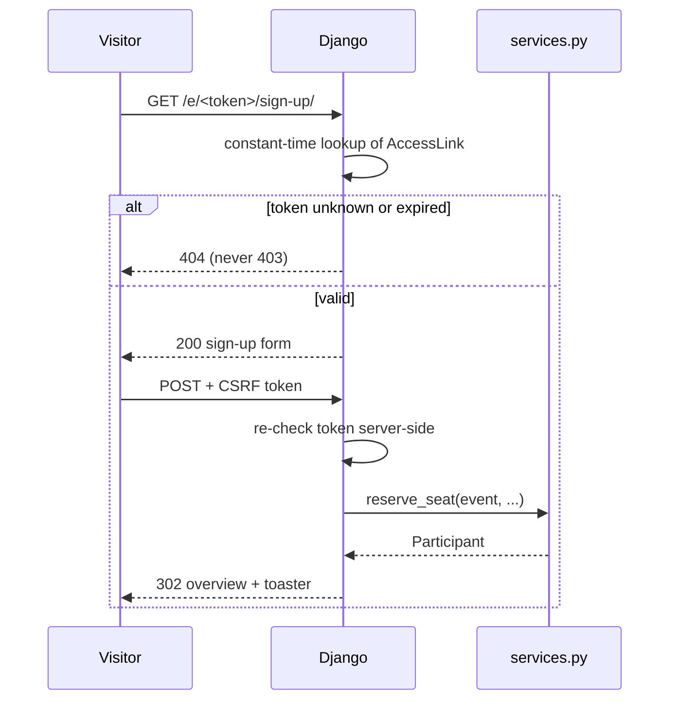

# Security

*What pykaraoke protects, how, and what it deliberately does not protect.*

## Threat model

A private site for one group of friends, holding real names and contact details. Realistic risks,
in order:

1. The link leaks (forwarded, screenshotted, indexed) and a stranger signs up or cancels seats.
2. Personal data lingers for years after a night nobody remembers.
3. A secret ends up committed to a public GitHub repository.
4. Someone floods the sign-up form and fills the event with junk.

Explicitly **not** in the threat model: a targeted attacker, insider threat, DDoS.

## Access control

There are no accounts and no passwords. Access is one unguessable link per event.

Rules:

- Tokens are `secrets.token_urlsafe(32)` — never a sequential id, never derived from event data.
- Lookups use a constant-time comparison; a timing difference is a slow token oracle.
- An unknown, expired, or unauthorised token gets **404, not 403**. A 403 confirms the event exists.
- **Every state-changing request re-checks the token server-side.** The session identifies which
  participant you are, as a convenience; it is not the security boundary.
- Rotating an event's token revokes every copy of the old link. That is the "kick someone out"
  mechanism.
- Admin routes require `request.user.is_staff` via Django's real auth, and return 404 to everyone
  else.

## Django settings baseline

Production must satisfy `python manage.py check --deploy` with no warnings. `security.yml` runs it
on every push.

| Setting | Production value |
|---|---|
| `DEBUG` | `False` |
| `SECRET_KEY` | from the environment, never committed |
| `ALLOWED_HOSTS` | the real hostnames, never `["*"]` |
| `SECURE_SSL_REDIRECT` | `True` |
| `SESSION_COOKIE_SECURE`, `CSRF_COOKIE_SECURE` | `True` |
| `SESSION_COOKIE_HTTPONLY` | `True` |
| `SECURE_HSTS_SECONDS` | `31536000`, with `INCLUDE_SUBDOMAINS` and `PRELOAD` |
| `X_FRAME_OPTIONS` | `DENY` |
| `SECURE_CONTENT_TYPE_NOSNIFF` | `True` |
| `CSRF_TRUSTED_ORIGINS` | the real origins |

CSRF protection is on for every POST — the confirmation modal submits a real form with
``, not a link.

## Personal data

| Field | Why it is collected | Classification |
|---|---|---|
| `pseudo` | shown on the public overview | pseudonymous |
| `full_name` | so the host knows who is coming | **PII** |
| `contact` | one confirmation message | **PII** |

Rules:

- **Collect the minimum.** Every new PII field must justify itself in the PR description.
- Personal data never reaches logs, error messages, exception reports, or an analytics call.
- No third-party trackers, no CDN that sees form contents, no external font that logs IPs.
- The database lives on a private network; it is never exposed to the public internet.

## Retention and purge

| Data | Kept until | Removed by |
|---|---|---|
| `AccessLink.token` | `expires_at` | purge job blanks the token |
| `Participant.full_name`, `.contact` | `starts_at` + 7 days | purge job |
| `SongRequest` rows | `starts_at` + 7 days | purge job |
| `pseudo`, `status`, counts | kept — no longer personal once names are gone | — |

The purge is a Django management command (`purge_expired_data`) run on a schedule by the platform's
cron. It is idempotent and logs counts, never values.

**A new PII field with no entry in this table is a blocking review finding.**

## Secrets

- `.env` is gitignored; `.env.example` holds placeholders only and is committed.
- Real values live in GitHub environment secrets and the platform's secret store.
- `.claude/settings.json` denies `Read(./.env)` and `Read(./.env.*)`, so Claude never sees them.
- `detect-private-key` runs in pre-commit; `bandit` and `pip-audit` run in `security.yml`.
- A leaked secret is rotated first and cleaned from history second — rotation is what actually
  fixes it.

## Abuse

- Sign-up, status-update and cancel routes are rate-limited per IP and per token (target: 10
  requests/minute). Without this, one link in a group chat is an open write endpoint.
- Exceeding the limit returns 429.
- The submit button disables on submit so a double-click cannot double-book a seat; the
  `unique_pseudo_per_event` constraint is the real guarantee.

## Dependencies

- `uv.lock` is committed — CI installs with `--locked`, so a compromised upstream release cannot
  silently enter a build.
- `pip-audit` runs on every push and weekly on a schedule.
- Dependency bumps go through a PR with a green pipeline. Never a direct push.

## Reporting

This is a private hobby project with no bug bounty. Tell the maintainer directly; do not open a
public issue containing a working exploit.

## See also

- Where authorisation is enforced: [ARCHITECTURE.md](ARCHITECTURE.md)
- Which routes need which check: [API.md](API.md)
- Fields and retention columns: [DATABASE.md](DATABASE.md)
- Automated checks: agent `security-reviewer`, workflow `security.yml`
